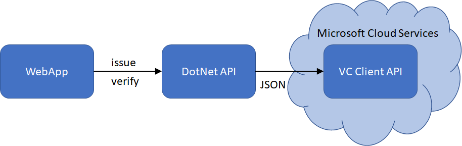

# Azure AD Verifiable Credentials samples
This repo contains a set of [Azure AD Verifiable Credentials](https://aka.ms/verifyonce) samples. 

## Samples

| Sample | Description |
|------|--------|
| api-dotnet | dotnet sample for using the VC Client API to issue and verify credentials |
| api-nodejs | node.js sample for using the VC Client API to issue and verify credentials |
| api-python | python sample for using the VC Client API to issue and verify credentials |
| b2c-vc-signin | B2C Signup and Signin extended with VC |
| vc-onboarding | ASP.Net dotnet core app for issuing credentials from current authenticated user (id_token_hint) |

## VC Client API
Initially, Microsoft provided a node.js SDK for building Verifiable Credentials applications. Going forward, it will be replaced by an API, since an API makes implementation easier and also is programming language agnostic. Instead of understanding the various functions in the SDK, in the programming language you use, you only have to understand how to format JSON structures for issuing or verifying VCs and call the VC Client API. 

Current version of the VC Client API is v0.3, and it introduces authorization which means you have to acquire an access token to use it. See the [Adding Authorization](https://github.com/cljung/did-samples/#adding-authorization) below for setting up your environment with it.



## Issuance

### Issuance JSON structure

To call the VC Client API to start the issuance process, the DotNet API creates a JSON structure like below. 

```JSON
{
  "authority": "did:ion: ...of the Issuer",
  "includeQRCode": true,
  "registration": {
    "clientName": "the verifier's client name"
  },
  "callback": {
    "url": "https://contoso.com/api/issuer/issuanceCallback",
    "state": "you pass your state here to correlate it when you get the callback",
    "headers": {
        "keyname": "any value you want in your callback"
    }
  },
  "issuance": {
    "type": "your credentialType",
    "manifest": "https://beta.did.msidentity.com/v1.0/3c32ed40-8a10-465b-8ba4-0b1e86882668/verifiableCredential/contracts/VerifiedCredentialExpert",
    "pin": {
      "value": "012345",
      "length": 6
    },
    "claims": {
      "mySpecialClaimOne": "mySpecialValueOne",
      "mySpecialClaimTwo": "mySpecialValueTwo"
    }
  }
}
```

- **authority** - is the DID identifier for your registered Verifiable Credential i portal.azure.com.
- **includeQRCode** - If you want the VC Client API to return a `data:image/png;base64` string of the QR code to present in the browser. If you select `false`, you must create the QR code yourself (which is not difficult).
- **registration.clientName** - name of your app which will be shown in the Microsoft Authentictor
- **callback.url** - a callback endpoint in your DotNet API. The VC Client API will call this endpoint when the issuance is completed.
- **callback.state** - A state value you provide so you can correlate this request when you get callback confirmation
- **callback.headers** - Any HTTP Header values that you would like the VC Clint API to pass back in the callbacks. Here you could set your own API key, for instance
- **issuance.type** - the name of your credentialType. Usually matches the last part of the manifest url
- **issuance.manifest** - url of your manifest for your VC. This comes from your defined Verifiable Credential in portal.azure.com
- **issuance.pin** - If you want to require a pin code in the Microsoft Authenticator for this issuance request. This can be useful if it is a self issuing situation where there is no possibility of asking the user to prove their identity via a login. If you don't want to use the pin functionality, you should not have the pin section in the JSON structure. The appsettings.PinCode.json contains a settings for issuing with pin code.
- **issuance.claims** - optional, extra claims you want to include in the VC.

In the response message from the VC Client API, it will include it's own callback url, which means that once the Microsoft Authenticator has scanned the QR code, it will contact the VC Client API directly and not your DotNet API. The DotNet API will get confirmation via the callback.

```json
{
    "requestId": "799f23ea-524a-45af-99ad-cf8e5018814e",
    "url": "openid://vc?request_uri=https://dev.did.msidentity.com/v1.0/abc/verifiablecredentials/request/178319f7-20be-4945-80fb-7d52d47ae82e",
    "expiry": 1622227690,
    "qrCode": "data:image/png;base64,iVBORw0KGgoA<SNIP>"
}
```

### Issuance Callback

In your callback endpoint, you will get a callback with the below message when the QR code is scanned.

```JSON
{"code":"request_retrieved","requestId":"9463da82-e397-45b6-a7a2-2c4223b9fdd0", "state": "...what you passed as the state value..."}
```

## Verification

### Verification JSON structure

To call the VC Client API to start the verification process, the DotNet API creates a JSON structure like below. Since the WebApp asks the user to present a VC, the request is also called `presentation request`.

```JSON
{
  "authority": "did:ion: did-of-the-Verifier",
  "includeQRCode": true,
  "registration": {
    "clientName": "the verifier's client name",
    "logoUrl": "https://test-relyingparty.azurewebsites.net/images/did_logo.png"
  },
  "callback": {
    "url": "https://contoso.com/api/verifier/presentationCallback",
    "state": "you pass your state here to correlate it when you get the callback",
    "headers": {
        "keyname": "any value you want in your callback"
    }
  },
  "presentation": {
    "includeReceipt": true,
    "requestedCredentials": [
      {
        "type": "your credentialType",
        "manifest": "https://portableidentitycards.azure-api.net/dev/536279f6-15cc-45f2-be2d-61e352b51eef/portableIdentities/contracts/MyCredentialTypeName",
        "purpose": "the purpose why the verifier asks for a VC",
        "trustedIssuers": [ "did:ion: ...of the Issuer" ]
      }
    ]
  }
}
```

Much of the data is the same in this JSON structure, but some differences needs explaining.

- **authority** vs **trustedIssuers** - The Verifier and the Issuer may be two different entities. For example, the Verifier might be a online service, like a car rental service, while the DID it is asking for is the issuing entity for drivers licenses. Note that `trustedIssuers` is a collection of DIDs, which means you can ask for multiple VCs from the user
- **presentation** - required for a Verification request. Note that `issuance` and `presentation` are mutually exclusive. You can't send both.
- **requestedCredentials** - please also note that the `requestedCredentials` is a collection too, which means you can ask to create a presentation request that contains multiple DIDs.
- **includeReceipt** - if set to true, the `presentation_verified` callback will contain the `receipt` element.

### Verification Callback

In your callback endpoint, you will get a callback with the below message when the QR code is scanned.

When the QR code is scanned, you get a short callback like this.
```JSON
{"code":"request_retrieved","requestId":"c18d8035-3fc8-4c27-a5db-9801e6232569", "state": "...what you passed as the state value..."}
```

Once the VC is verified, you get a second, more complete, callback which contains all the details on what whas presented by the user.

```JSON
{
    "code":"presentation_verified",
    "requestId":"c18d8035-3fc8-4c27-a5db-9801e6232569",
    "state": "...what you passed as the state value...",
    "subject": "did:ion: ... of the VC holder...",
    "issuers": [
      {
          "type": [ "VerifiableCredential", "your credentialType" ],
          "claims": {
            "displayName":"Alice Contoso",
            "sub":"...",
            "tid":"...",
            "username":"alice@contoso.com",
            "lastName":"Contoso",
            "firstName":"alice"
          }
      }
    ],
    "receipt":{
        "id_token": "...JWT Token of VC..."
        }
    }
}
```
Some notable attributes in the message:
- **claims** - parsed claims from the VC
- **receipt.id_token** - the DID of the presentation

## Adding Authorization 
The v0.3 version of the VC Client API requires that you pass an access token for authorization. This sample now uses MSAL to aquire an access token via client_credentials.
The access token is needed because the VC Client API needs to access your Azure Key Vault to get your signing keys.
You therefor need to create a new App Registration in your Azure AD tenant (the tenant that is protecting your Azure subscription where your Azure Key Vault is deployed). 
This App also needs to have API Permissions granted to VC Client API, because this API is going to be the one accessing your Azure Key Vault. 

### VC Client API Service Principle
First you need to create a Sercice Principle for the API `Verifiable Credential Request Service`, which is the Microsoft service that will access your Key Vault.
You do this via the following Powershell command

```Powershell
Connect-AzureAD -TenantId <your-tenantid-guid>
New-AzureADServicePrincipal -AppId "bbb94529-53a3-4be5-a069-7eaf2712b826" -DisplayName "Verifiable Credential Request Service" 
```

### App Registration for Client Credentials
Your app needs a way to get an access token and this is done via the client credentials flow. You can register a Web app, accept the defaults, and set the redirect_uri `https://localhost`.
The important thing is to add an `API Permission` for API `Verifiable Credential Request Service` and permission `VerifiableCredential.Create.All`.

### Update your Access Policy for Azure Key Vault
The VC Client API needs to have access to your Azure Key Vault. You need to add a new `Access Policy` in your Azure Key Vault for the API `Verifiable Credential Request Service` with "Get" and "Sign" for Key Permissions and "Get" for Secret Permissions.

### Update your solutions configuration file
Depending on your programming language, you need to update your solutions configuration file. For a dotnet app this would be the appsettings.json file, and in that file you need add the tenant id (guid) for the `TenantID`, the AppID for the `ClientId` and the secret for the `ClientSecret`. Check each sample for detailed instructions.

```JSON
    "TenantId": "",
    "ClientId": "",
    "ClientSecret": "",
```
