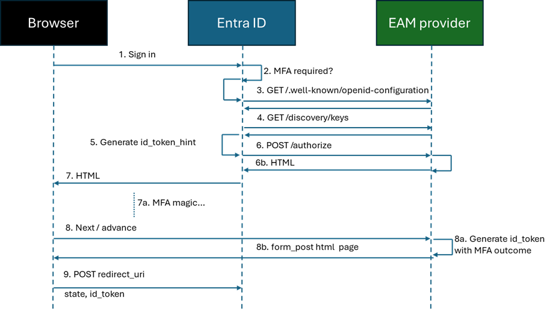
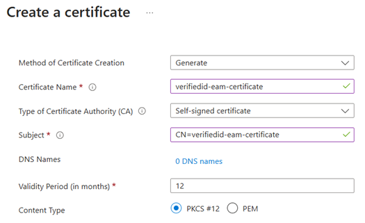
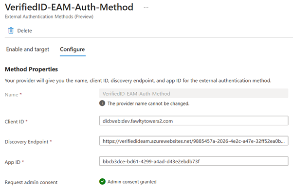

# VerifiedIDEAM

Sample code for MFA via Entra Verified ID and [External Authentication Method](https://learn.microsoft.com/en-us/entra/identity/authentication/how-to-authentication-external-method-manage) (EAM).

If you deploy this app to Azure App Services, it needs to atleast have a B1 plan due to working with certificates. If you deploy to a Free or Shared plan, you will receive X509-related errors. 

## How does EAM work?

1.	The user starts authentication with Entra ID to use an app
2.	Entra ID determines that MFA is required and discovers that an EAM provider is configured
3.	API call to /.well-known/openid-configuration endpoint to get IDP details
4.	API call to /discovery/keys to retrieve the public key(s) for the EAM provider
5.	Entra ID generates the id_token_hint that contains claims about who the user is trying to sign in (preferred_username). 
6.	Entra ID makes a HTTP POST to the EAM providers /authorize endpoint (see details below).
    a. The EAM provider validates the form data in the call and the validity of the passed id_token_hint. If the EAM provider cannot process the call, it should return a HTTP 400 status code.
    b. If the The EAM provider can process the MFA request, it return an HTML response with the MFA UI.
7.	Entra ID sends the HTML to the browser
    a.	The EAM provider does its MFA magic, meaning it can be a multi-page sequence, calling backend APIs, etc. Control is with the EAM provider at this point.
8.	When the EAM provider is done with its MFA task, it needs to advance the UI in order to progress the Entra ID sign in flow. It therefore needs to redirect to a url in the EAM provider to handle this. 
    a. This endpoint checks the outcome of the MFA, and if successful, the EAM provider should generate an id_token to be given to Entra Id (see details below).
    b. The response is a small HTML page that contains the data (state and id_token) to be passed back to Entra’s redirect_uri
9.	Entra ID passes the small HTML page to the browser which immediately makes a form post back to Entra’s redirect_uri. Entra ID evaluates the supplied id_token with the MFA result and the sign in flow continues.

## How this sample looks like in action

This video shows using this sample in action

<video src="../media/VierifiedID-EAM-MFA.mp4" width="320" height="240" controls>VerifiedID EAM video</video>

## How does this sample work?

### OpenID Connect provider

This sample doesn't implement a full OIDC server. It just implements the three endpoints that EAM uses. This means it is a significantly reduced security risk.

| HTTP Method | API | Content-Type |
|------|--------|--------|
| GET | /v2.0/.well-known/openid-configuration | application/json |
| GET | /discovery/v2.0/keys | application/json |
| POST | /oauth2/v2.0/authorize	| application/x-www-form-urlencoded |

### Signing JWT tokens for Entra ID

The EAM provider needs to have an X509 certificate to sign the JWT id_tokens it is emitting as a result of the MFA. You can generate a self-signed certificate in Azure Key Vault and have the provider using the Key Vault APIs to retrieve the certificate when its time to either return the public key in the discovery service or sign an id_token.
The EAM provider app would need to have Certificate Permission “Get” in Key Vault’s Access policies.

### EAM configuration

When you configure EAM in the Entra portal, you do it in the following way:

| Item | Value | Content-Type |
|------|--------|--------|
| Client ID | DID of your Verified ID authority | We need to pass the accepted issuing authority of the VC being requested. 
That could be configured in appsettings.json, etc, but that would limit the sample from being multi-tenant. This value is going to be passed as the `client_id` claim in the id_token_hint Entra ID passes in the /authorize call. |
| Discovery Endpoint | URL to .well-known/openid-configuration | The sample expects that the Entra tenant ID is part of the URL |
| App ID | guid	| EAM requires you to specify an App ID, so set any value. |

The VerifiedEmployee credential the user presents needs to have been issued by a Verified ID authority that exists in the Entra tenant that holds the user. We can’t accept a VerifiedEmployee issued by anyone just because it matches the preferred_username, that would be a security threat. So, the presentation request needs to set the acceptedIssuers property of the request to target the Verified ID issuer for the correct Entra tenant. The problem here is that Entra’s EAM framework knows nothing about that we are planning to use Verified ID. However, there is a simple solution, and that is to use the client_id value in configuring the EAM provider. If we set this to the DID of the issuer, it gets passed to us in the /authority call and we can use it to target the correct issuer of the VerifiedEmployee credential. 

### Creating the presention request for VerifiedEmployee

When Entra ID calls our /authorize endpoint, we get the email in the `preferred_username` claim in the JWT id_token_hint Entra provides. 
The problem here is that it could be a B2B guest user invited from another tenant or a Microsoft Account. We are asking for a VerifiedEmployee from a member user in our directory, not a guest user. For this reason, the sample loads the .well-known/openid-configuration from the caller's Entra ID tenant so we can see if that information contains the user's domain. If it is a B2B guest user, we really should ask for a VerifiedEmployee from the user's home tenant, but the sample haven't implemented that. It asks for a VerifiedEmployee from _any_ issuer.

