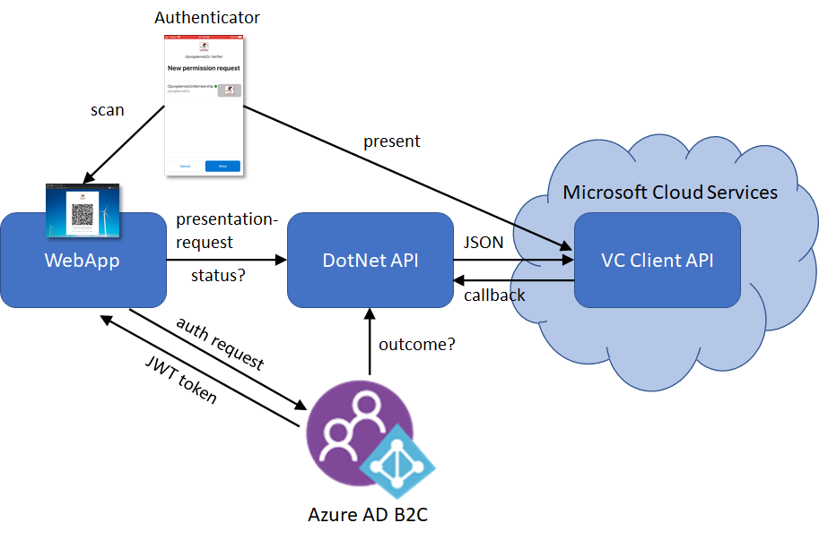
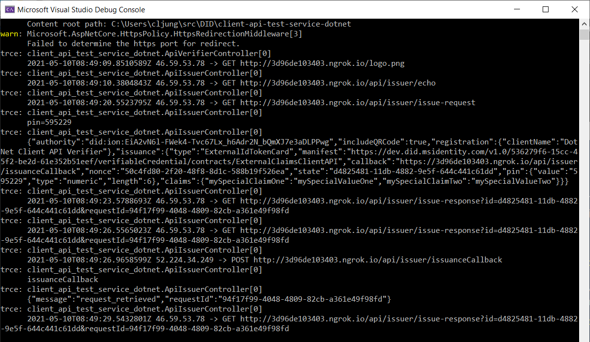

# client-api-test-service-dotnet
Azure AD Verifiable Credentials ASP.Net Core 3.1  sample that uses the new private preview VC Client APIs.
This sample is updated to work with version v0.3 which introduces authorization and the use of an access token when calling the API. Please read the section on [Adding Authorization](https://github.com/cljung/did-samples#adding-authorization) to see what additions you need to do.

## Two modes of operations
This sample can work in two ways:
- As a standalone WebApp with it's own web UI that let's you issue and verify DID Verifiable Credentials.
- As an API service that works in combination with Azure AD B2C in order to use VCs as a way to authenticate to B2C.

## VC Client API, what is that?

Please read the top level [README.md](https://github.com/cljung/did-samples) for an introduction.

## Running the sample

### Standalone
To run the sample standalone, just clone the repository, compile & run it. It's callback endpoint must be publically reachable, and for that reason, use `ngrok` as a reverse proxy to read your app.

```Powershell
git clone https://github.com/cljung/did-samples.git
cd did-samples/api-dotnet
dotnet build "client-api-test-service-dotnet.csproj" -c Debug -o .\bin\Debug\netcoreapp3.1
dotnet run
```

You can specify a which credentials you should issue and verify by specifying the payload files on the command line. Read more on how to author these files below.
```Powershell
dotnet run /IssuanceRequestConfigFile=%cd%\requests\issuance_request_cljungdemob2c.json /PresentationRequestConfigFile=%cd%\requests\presentation_request_cljungdemob2c.json
```

Then, open a separate command prompt and run the following command

```Powershell
ngrok http 5002
```

Grab, the url in the ngrok output (like `https://96a139d4199b.ngrok.io`) and Browse to it.

### Docker build

To run it locally with Docker
```
docker build -t client-api-test-service-dotnet:v1.0 .
docker run --rm -it -p 5002:80 -e IssuanceRequestConfigFile=./requests/issuance_request_config_v2.json -e PresentationRequestConfigFile=./requests/presentation_request_config_v2.json client-api-test-service-dotnet:v1.0
```

Then, open a separate command prompt and run the following command

```Powershell
ngrok http 5002
```

Grab, the url in the ngrok output (like `https://96a139d4199b.ngrok.io`) and Browse to it.

### Author the json payload files

There are a few samples of json files in the `requests` folder and you can clone them as you like to use other credentials. As you can see in the sample files, much of the details are not specified. These are the autofill fules:

- **manifest** - you must specify the manifest url as the app downloads on the first request.
- **type** - you ***only*** need to specify the type if it is different that the last part of the manifest url (usually they are the same)
- **authority** - you need to set this to a `did:ion:...` DID ***if*** you are doing verification of a Verifiable Credentials of a VC that was issued by another party. If you are verifying credentials you issued yourself, the DID in the manifest is used.

Other important things to consider

- **pin** - do not specify a pin-element unless you are issuing credentials where you want a pin code. Either remove the element or set the length to 0.
- **claims** - do not specify the claims element unless you are issuing credentials using the so called `id_token_hint` model.

### id_token_hint model

With the id_token_hint model, you don't configure a OIDC identity provider .well-known/openid-configuration in your Verifiable Credentials rules file. You manage the authentication yourself as a pre-step to starting and you then pass your required claims to the issuing service.

### Together with Azure AD B2C
To use this sample together with Azure AD B2C, you first needs to build it, which means follow the steps above. 



Then you need to deploy B2C Custom Policies that has configuration to add Verifiable Credentials as a Claims Provider and to integrate with this DotNet API. This, you will find in the github repo [https://github.com/cljung/did-samples/b2c-vc-signin](https://github.com/cljung/tree/main/b2c-vc-signin). That repo has a node.js issuer/verifier WebApp that uses the VC SDK, but you can skip the `vc` directory and only work with what is in the `b2c` directory. In the instructions on how to edit the B2C policies, it is mentioned that you need to update the `VCServiceUrl` and the `ServiceUrl` to point to your API. That means you need to update it with your `ngrok` url you got when you started the DotNet API in this sample. Otherwise, follow the instructions in [https://github.com/cljung/did-samples/blob/main/b2c-vc-signin/b2c/README.md](https://github.com/cljung/did-samples/blob/main/b2c-vc-signin/b2c/README.md) and deploy the B2C Custom Policies

### LogLevel Trace

If you set the LogLevel to `Trace` in the appsettings.*.json file, then the DotNet sample will output all HTTP requests, which will make it convenient for you to study the interaction between components.

