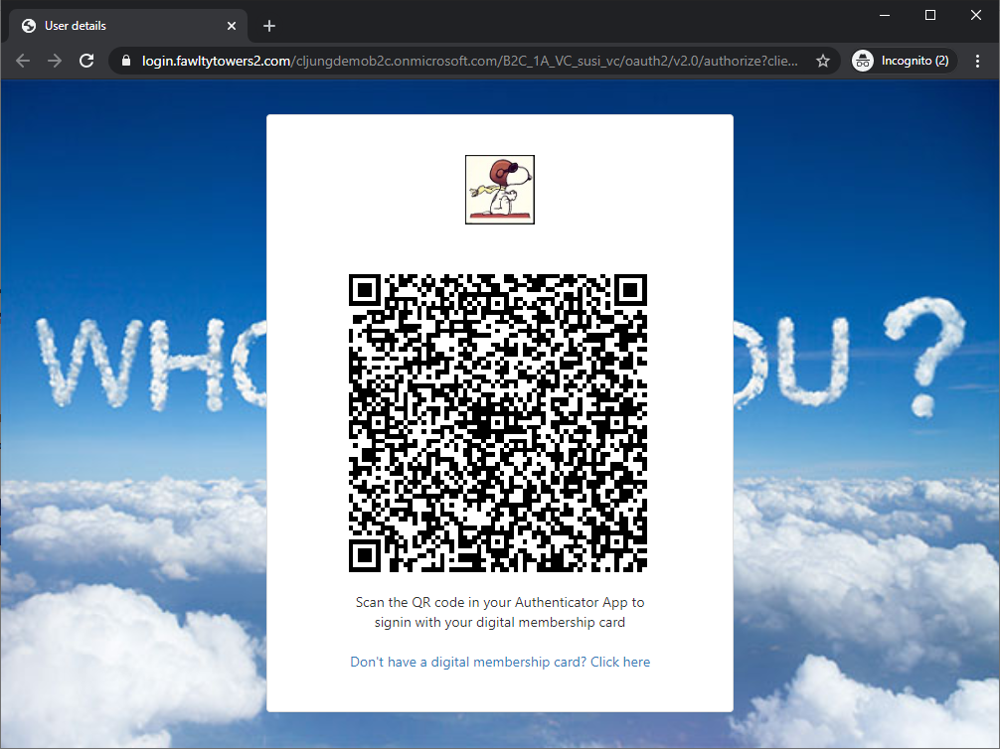

# B2C-VC-Signin
Signin to Azure AD B2C with Verifiable Credentials.

## What you will be able to do with the solution in this repository is:

- Issue Verifiable Credentials from your B2C tenant to Microsoft Authenticator on your smartphone
- Signin to B2C with your verifiable Credentials by scanning a QR code
 

## What you need to deploy and test this solution is

- An Azure AD with atleast one P2 license
- An Azure subscription
- An Azure AD B2C tenant
- Latest Microsoft Authenticator on an iOS or Android mobile device
 
## What you will deploy

- Verifiable Credentials in your Azure AD premium tenant
- An Azure Key Vault instance (or use an existing)
- An Azure Storage Account (or use an existing)
- An Azure AD B2C tenant (or use an existing)
- A public website, like Azure AppServices, for the VC issuer
- A public website, like Azure AppServices, for the VC verifier
 
For the public website, you can use [ngrok](https://ngrok.com/) during development to run the websites from your local laptop.

## Live site for testing

You can try a deployed version of the solution via running this [B2C Policy](https://login.fawltytowers2.com/cljungdemob2c.onmicrosoft.com/B2C_1A_VC_susi/oauth2/v2.0/authorize?client_id=d636beb4-e0c5-4c5e-9bb0-d2fd4e1f9525&nonce=9ec44592-ffde-45c2-a930-03a25f48dc0c&redirect_uri=https%3A%2F%2Fjwt.ms&scope=openid&response_type=id_token&prompt=login&disable_cache=true) in your browser.

Steps:

1. The first time you run it, sign up for a B2C local account.
1. The second time you run it, select button `Verifiable Credentials` and click on the `Don't have a digital membership card?` link to issue yourself a Veribiable Credential that is stored in your Microsoft Authenticator on your phone.
1. The third time you run it, select button `Verifiable Credentials` and scan the QR code to login to your B2C account. 